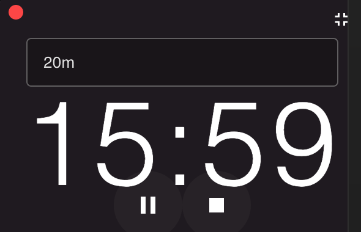

# Super Easy Timer

Super Easy Timer is a minimalist, user-friendly desktop timer application built with Electron and Vue.js. It features natural language time input, a sleek interface, and a convenient mini-mode for better desktop integration.



## Features

- 🎯 Natural language time input (e.g., "20 min", "1 hour", "2.5 hours")
- 🔄 Play, pause, and reset controls
- 📱 Mini-mode for compact view
- 🖥️ Always-on-top window
- 🎨 Modern, transparent UI
- 🚀 Cross-platform support

## Installation

1. Clone the repository:
```bash
git clone https://github.com/yourusername/super-easy-timer.git
cd super-easy-timer
```

2. Install dependencies:
```bash
npm install
```

3. Run in development mode:
```bash
npm run dev
```

4. Build for production:
```bash
npm run build
```

## Usage

1. Launch the application
2. Enter time using natural language (e.g., "20 min", "1 hour")
3. Use play/pause button to control the timer
4. Click the minimize button to switch to mini-mode
5. Use the red button to close the application

## Screenshots

### Normal Mode


### Mini Mode


## Development

- Built with Vue 3 + Vite
- Uses Electron for desktop integration
- Styled with Vuetify 3
- Natural language parsing with chrono-node

## Contributing

Contributions are welcome! Please feel free to submit a Pull Request.

## License

This project is licensed under the MIT License - see the LICENSE file for details.